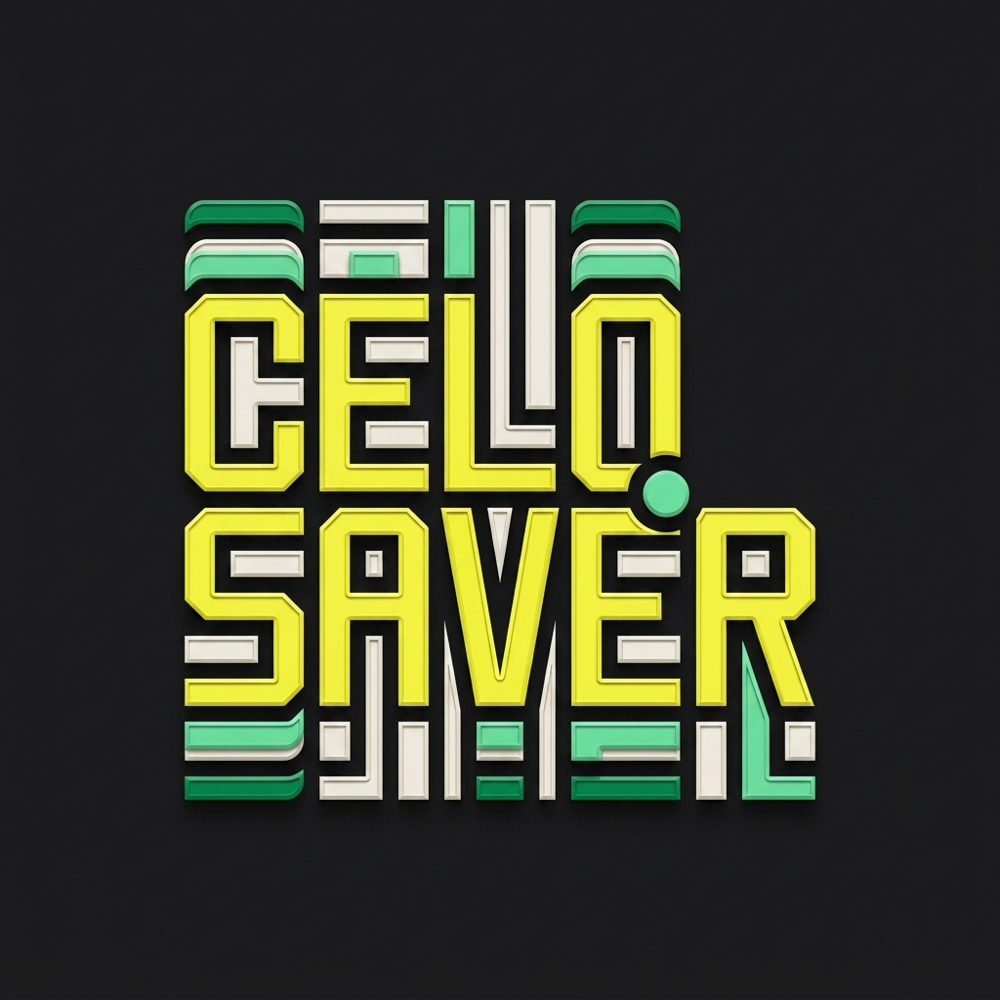

# CeloSaver

<p align="center">
  
</p>

CeloSaver is a stablecoin savings application built for Celo MiniPay. It tracks deposits into a vault and maintains on-chain streaks to help users build a consistent savings habit.

## Features
- Deposits of cUSD into the CeloSaverVault with immediate liquidity.
- Streak tracking to monitor daily deposits.
- A simplified interface intended for mobile wallet users.
- Design based on glassmorphic principles with basic animations.

## Live on Celo Mainnet
- Vault Contract: `0x4bA6398eb0ee5fdC7b45e7DE3F042d27090FB72E`
- cUSD Token: `0x765DE816845861e75A25fCA122bb6898B8B1282a`

## Developer SDK (NPM)
The logic for CeloSaver is available as an NPM package for integration into other Celo applications.

```bash
npm install @cryptoflops/celo-saver
```

### Usage
```typescript
import { useCeloSaver } from '@cryptoflops/celo-saver';

const { deposit, vaultBalance, streak } = useCeloSaver();
```

## Local Development
1. Clone the repository.
2. Run `npm install`
3. Run `npm run dev`

## License
MIT
