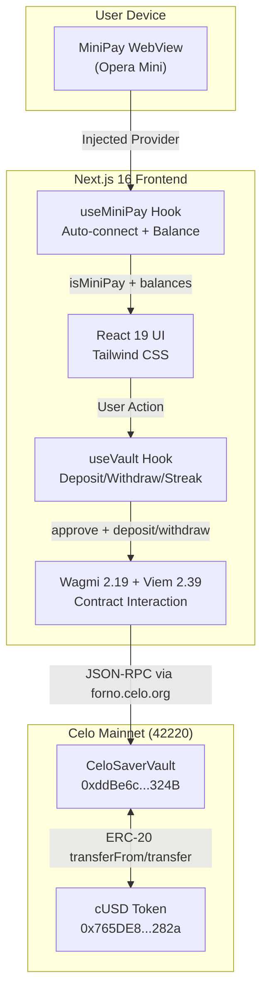

# CeloSaver Architecture

## System Overview

## Component Architecture

| Layer | Component | Purpose |
|-------|-----------|---------|
| **Entry** | `app/layout.tsx` | Root layout, fonts, metadata, nav |
| **Provider** | `ClientWrapper` > `ContextProvider` | WagmiProvider, QueryClient, AppKit, NetworkEnforcer, MiniPayBar |
| **Pages** | `app/page.tsx` | Dashboard with balance overview, streak widget, yield projection |
| | `app/deposit/page.tsx` | Approve cUSD + deposit into vault |
| | `app/vault/page.tsx` | View balance + withdraw |
| | `app/streak/page.tsx` | Streak history + milestones |
| **Hooks** | `useMiniPay` | MiniPay detection, auto-connect, chain forcing, stablecoin balances |
| | `useVault` | Contract read/write (deposit, withdraw, approve, userData, balance) |
| **Contract** | `CeloSaverVault.sol` | Solidity 0.8.19, streak tracking, cUSD vault |

## Tech Stack

| Category | Technology | Version |
|----------|-----------|---------|
| Framework | Next.js (App Router) | 16.2.3 |
| UI | React | 19.2.0 |
| Styling | Tailwind CSS | 3.4.18 |
| Web3 | Wagmi | 2.19.4 |
| Web3 | Viem | 2.39.2 |
| Wallet | Reown AppKit | 1.8.14 |
| Icons | Lucide React | 1.16.0 |
| Deploy | Cloudflare Pages | via OpenNext |

## Smart Contract

**CeloSaverVault** (Solidity 0.8.19)
- `deposit(uint256 amount)` -- transfer cUSD to vault, track streak (daily = increment, gap > 1 day = reset)
- `withdraw(uint256 amount)` -- withdraw cUSD from vault
- `users(address)` -- returns `(balance, currentStreak, lastDepositTime)`
- Events: `Deposited`, `Withdrawn`

## Data Flow

1. User opens CeloSaver in MiniPay
2. `useMiniPay` detects injected provider, auto-connects, forces Celo chain
3. `MiniPayBar` displays cUSD/cEUR balances
4. User navigates to Deposit, enters amount
5. `useApproveVault` sends ERC-20 approve to cUSD contract
6. `useDeposit` calls `vault.deposit(amount)`
7. Vault increments streak if deposit is within 24h of last deposit
8. Dashboard updates via `useUserData` refetch
